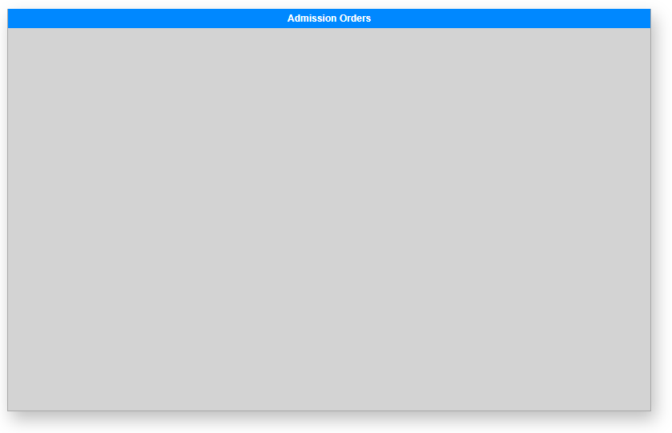
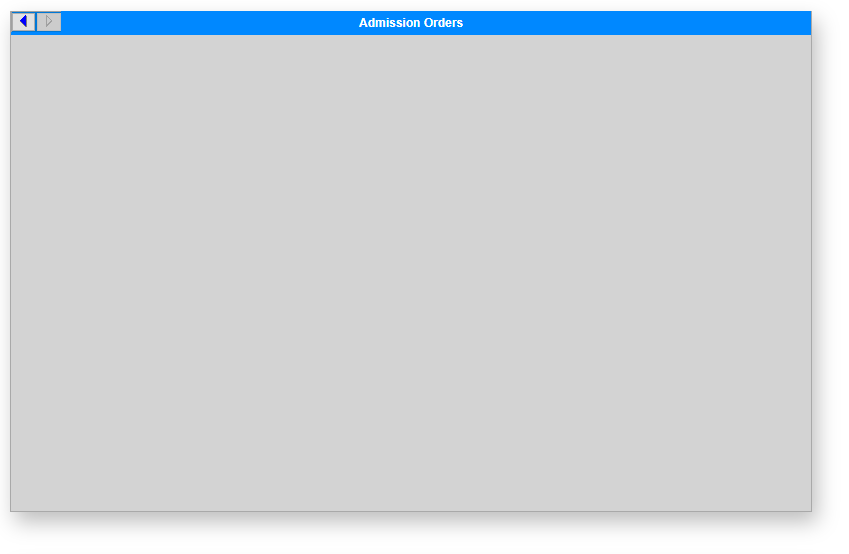
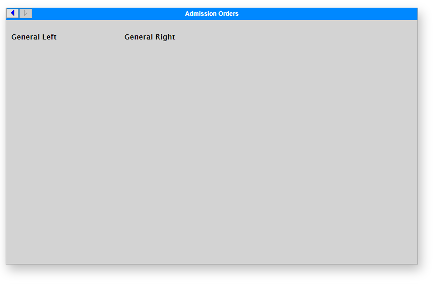
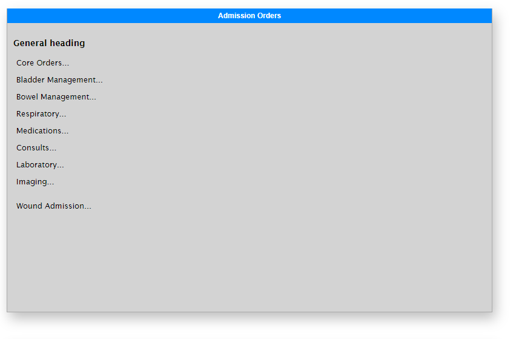
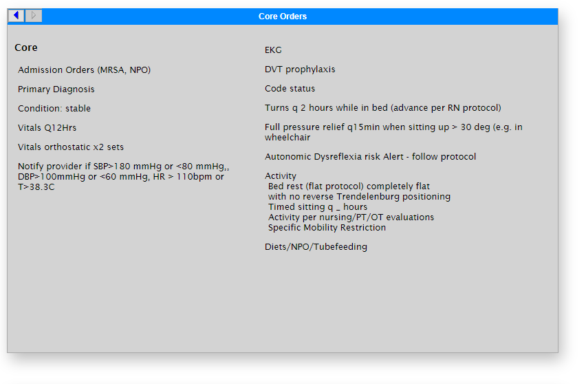
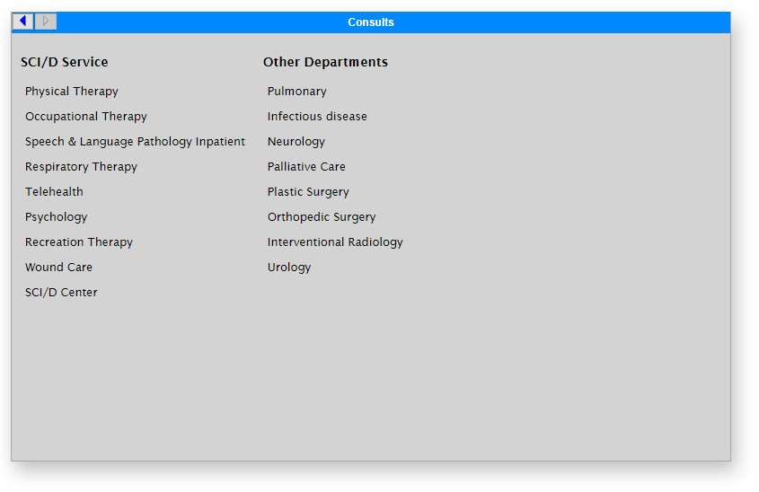
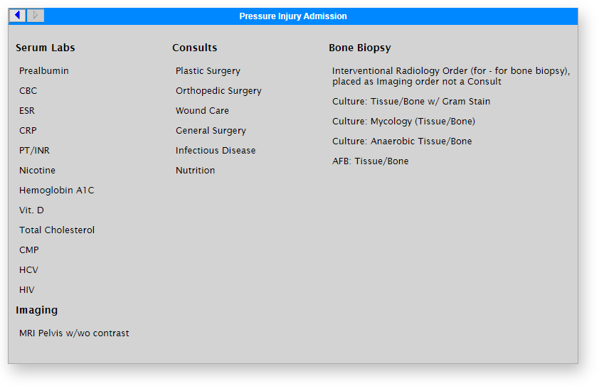
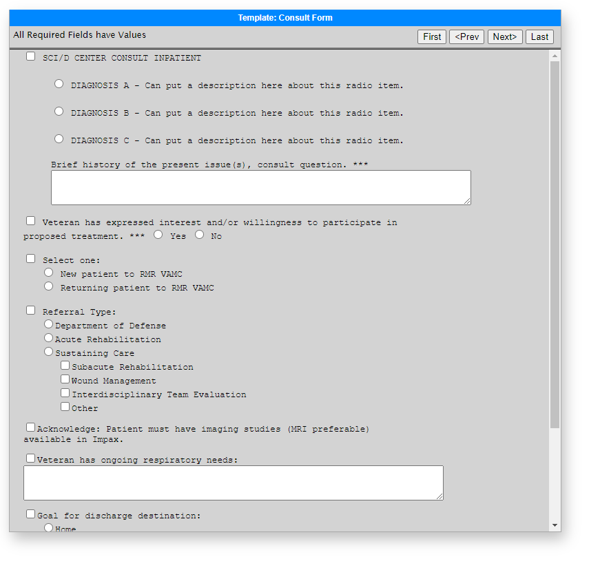


# CPRS Mockups

## Introduction
The Department of Veterans Affairs uses the electronic medical record system [VistA](https://en.wikipedia.org/wiki/VistA) with Computerized Patient Record System (CPRS) as the graphical user interface. Custom menus can be created with the help of the Clinical Applications team. The development process can be more efficient with the use of mockups to visually show what is requested in CPRS. 

Here I use HTML and CSS to quickly create mockups rendered in Google Chrome. Besides a text editor (even Notepad works), no special software is needed and these can be created on VA computers. 

## Step-by-step building a Menu Pane

### Create a blank pane
```html
<div  class="cprs-pane"></div>
```


### Add a menu title
```html
<div  class="cprs-pane">
	<h1>Add a title for the menu</h1>
</div>
```


### Add forward and back buttons
```html
<div  class="cprs-pane">
	<div  class="backfwd"></div>
	<h1>Admission Orders</h1>
</div>
```


### Setup column structure
Each column is defined by a child `div` of the `div` with class `cprs-columns`. 

Use `h2` for headings within columns. The column widths expand to the content or can be set manually in CSS. 

```html
<div  class="cprs-pane">
	<div  class="backfwd"></div>
	<h1>Admission Orders</h1>
	<div  class="cprs-columns">
		<div><h2>General Left</h2></div>
		<div><h2>General Right</h2></div>
	</div>
</div>
```


### Add column content

Use an unordered list to create the column content. 
```html
<div  class="cprs-pane">
	<div  class="backfwd"></div>
	<h1>Admission Orders</h1>
	<div  class="cprs-columns">
		<div>
			<h2>General Heading</h2>
			<ul>
				<li>Core Orders...</li>
				<li>Bladder Management...</li>
				<li>Bowel Management...</li>
				<li>Respiratory...</li>
				<li>Medications...</li>
				<li>Consults...</li>
				<li>Laboratory...</li>
				<li>Imaging...</li>
				<li>&nbsp;</li>
				<li>Wound Admission...</li>
			</ul>
		</div>
	</div>
</div>
```


### Adding details below an item
Unordered lists that are children of a column `li` have a more compact layout for multi-line descriptions, for example. 
```html
<div class="cprs-pane">
	<div class="backfwd"></div>
	<h1>Core Orders</h1>
	<div class="cprs-columns">
		<div>
			<h2>Core</h2>
			<ul>
				<li>Admission Orders (MRSA, NPO)</li>
				<li>Primary Diagnosis</li>
				<li>Condition: stable</li>
				<li>Vitals Q12Hrs</li>
				<li>Vitals orthostatic x2 sets</li>
				<li>Notify provider if SBP>180 mmHg or <80 mmHg,<br />
				DBP>100mmHg or <60 mmHg, HR > 110bpm or T>38.3C</li>
			</ul>
		</div>
	
		<div>
			<ul>
				<li>EKG</li>
				<li>DVT prophylaxis</li>
				<li>Code status</li>
				<li>Turns q 2 hours while in bed (advance per RN protocol)</li>
				<li>Full pressure relief q15min when sitting up > 30 deg (e.g. in wheelchair</li>
				<li>Activity
					<ul>
						<li>Bed rest (flat protocol) completely flat<br  /> with no reverse Trendelenburg positioning</li>
						<li>Timed sitting q 4 hours</li>
						<li>Activity per nursing/PT/OT evaluations</li>
						<li>Specific Mobility Restriction</li>
					</ul>
				</li> 

				<li>Diets/NPO/Tubefeeding</li>
			</ul>
		</div>
	</div>
</div>
```


### Other Examples of Menu panes
```html
<div class="cprs-pane">
	<div  class="backfwd">&nbsp;</div>
	<h1>Consults</h1>
	<div  class="cprs-columns">
		<div>
			<h2>SCI/D Service</h2>
			<ul>
				<li>Physical Therapy</li>
				<li>Occupational Therapy</li>
				<li>Speech & Language Pathology Inpatient</li>
				<li>Respiratory Therapy</li>
				<li>Telehealth </li>
				<li>Psychology </li>
				<li>Recreation Therapy </li>
				<li>Wound Care</li>
				<li>SCI/D Center</li>
			</ul>
		</div>

		<div>
			<h2>Other Departments</h2>
			<ul>
				<li>Pulmonary</li>
				<li>Infectious disease</li>
				<li>Neurology</li>
				<li>Palliative Care </li>
				<li>Plastic Surgery</li>
				<li>Orthopedic Surgery</li>
				<li>Interventional Radiology</li>
				<li>Urology</li>
			</ul>
		</div>
	</div>
</div>
```


```html
<div class="cprs-pane">
	<div class="backfwd">&nbsp;</div>
	<h1>Pressure Injury Admission</h1>
	<div class="cprs-columns">
		<div>
		<h2>Serum Labs</h2>
		<ul>
			<li>Prealbumin</li>
			<li>CBC</li>
			<li>ESR</li>
			<li>CRP</li>
			<li>PT/INR</li>
			<li>Nicotine</li>
			<li>Hemoglobin A1C</li>
			<li>Vit. D</li>
			<li>Total Cholesterol</li>
			<li>CMP</li>
			<li>HCV</li>
			<li>HIV</li>
		</ul>
		<h2>Imaging</h2>
		<ul>
			<li>MRI Pelvis w/wo contrast</li>
		</ul>
	</div>
	<div>
		<h2>Consults</h2>
		<ul>
			<li>Plastic Surgery</li>
			<li>Orthopedic Surgery</li>
			<li>Wound Care</li>
			<li>General Surgery</li>
			<li>Infectious Disease</li>
			<li>Nutrition</li>
		</ul>
	</div>
	<div>
		<h2>Bone Biopsy</h2>
		<ul>
			<li>Interventional Radiology Order (for - for bone biopsy), placed as Imaging order not a Consult</li>
			<li>Culture: Tissue/Bone w/ Gram Stain</li>
			<li>Culture: Mycology (Tissue/Bone)</li>
			<li>Culture: Anaerobic Tissue/Bone</li>
			<li>AFB: Tissue/Bone</li>
		</ul>
	</div>
	</div>
</div>
```


## Building a Template

Templates can be used as targets for menu options, consult structures, etc. View the [templates.html](templates.html) file to see the finished example. It makes use of CSS classes to adjust formatting of the html. 



### Disclaimer
This repository is not associated with the Department of Veterans Affairs. 
